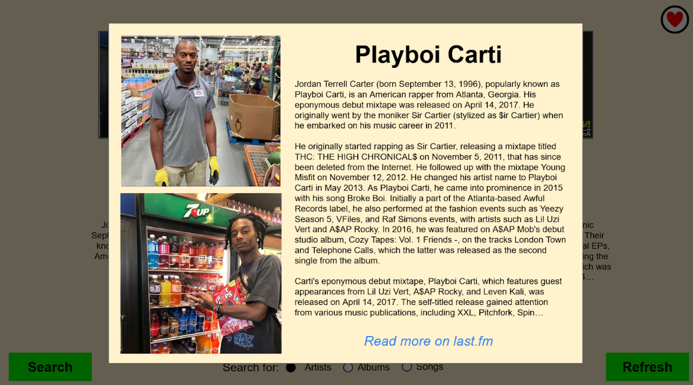

# SongSurf
## Description
__SongSurf__ allows you to discover new music that you'll love through an informative, attractive, and intuitive website.  Input your favorite artists, albums, or songs and receive recommendations based on what you love.  SongSurf also allows you to track your favorite discoveries for future use.

## Project Features
* Algorithm-based music discovery generation for tracks, artists, and albums.
* Configurable search for track, artist, or album.
* Ability for users to like/dislike 
* Generated list of liked tracks/artists/albums
* Intuitive and easy to use interface
* and more!

### How to [Install and Run](Documentation/HOW_TO_RUN.txt)
1. Install [Python 3](https://www.python.org/downloads/)
2. Clone repository, then enter
``` 
unix/win> git clone https://github.com/comp195/SongSurf.git
unix/win> cd SongSurf
```
3. Create a virtual environment
``` 
windows> python -m venv my_venv
or
unix> python3 -m venv my_venv
```
4. Activate virtual environment
```
windows> my_venv\Scripts\activate
or
unix> source my_venv/bin/activate
```
5. Install the required libraries
```
windows> pip install -r requirements.txt
or
unix> pip3 install -r requirements.txt
```
6. Run the flask server
```
windows> python src/backend/app.py
or
unix> python3 src/backend/app.py
```
7. Open the website link in the console
```
http://127.0.0.1:8000
```

## Application - Demonstration
### Welcome User


### Signup/Login


### User Input

### Recommendations


## Application - Initial Prototype
### Search and Discover

 
### Information/Bio and Favorites
 
 

     
## Developers
1. Shahbaj Sohal: s_sohal2@u.pacific.edu
2. William Balbuena: w_balbuena@u.pacific.edu
3. Patrick Nisperos: p_nisperos@u.pacific.edu


### Tech Stack
- [Flask](https://flask.palletsprojects.com/en/2.2.x/) - 🛠️ The Python micro framework for building web applications.
- [last.fm](https://www.last.fm/api) - 🛠️ API allows building own program using Last.fm data.
- [Python](https://www.python.org/) - 🛠️ A general-purpose programming language useful for backend.
- [JavaScript](https://www.javascript.com/) - 🛠️ A scripting language that enables you to create dynamically updating content, and anything web related. 
- [SQL](https://www.tutorialspoint.com/sql/sql-overview.htm) - 🛠️ A programming language used to manage data stored in relational databases, which store structured data in tables. 

### Design Patterns
Our code utilizes some software design patterns to ensure quality and scalability.
- [Facade](https://www.tutorialspoint.com/design_pattern/facade_pattern.htm) - 📦 All data displayed to the user in the front end retrieve data from simplified function calls from the backend. Which include: Our database, the API calls for albums, artists, tracks, and the recommendation algorithm


